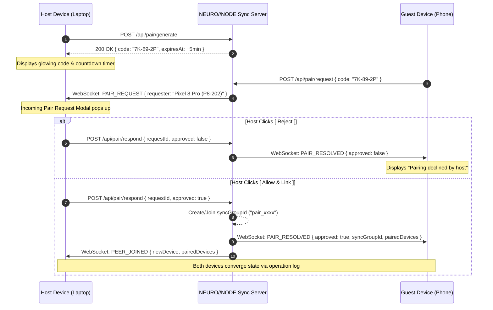

# NEURO//NODE // Multi-Device Offline-First Sync Architecture

## 1. Architectural Philosophy

The **NEURO//NODE Command Dashboard** is designed around a strict **Local-First, Offline-Capable, Multi-Device Synchronized** architecture.

```
+-------------------------------------------------------------------------+
|                              LOCAL BROWSER                              |
|                                                                         |
|   +-----------------------------------------------------------------+   |
|   |                NEURO//NODE User Interface (React 19)            |   |
|   |         0ms Latency - Immediate Optimistic UI Updates           |   |
|   +-----------------------------------------------------------------+   |
|                                    |                                    |
|                                    v                                    |
|   +-----------------------------------------------------------------+   |
|   |          LocalStorage Primary Engine (Browser Sandboxed)        |   |
|   |               Zero Cloud Dependency for Core Runtime            |   |
|   +-----------------------------------------------------------------+   |
|          |                                            |                 |
|          v                                            v                 |
|   +---------------+                        +----------------------+     |
|   | Multi-Tab Sync|                        |  Sync Engine Queue   |     |
|   | BroadcastChan |                        | (pendingChanges in   |     |
|   +---------------+                        |    LocalStorage)     |     |
|                                            +----------------------+     |
+-------------------------------------------------------|-----------------+
                                                        |
                               (Encrypted WS / REST)    |
                                                        v
                                              +----------------------+
                                              |NEURO//NODE SyncServer|
                                              |  - Monotonic Revisions
                                              |  - Atomic Log Storage|
                                              |  - Ephemeral Pairing |
                                              +----------------------+
                                                         |
                                                         v
                                              +----------------------+
                                              |   Paired Device B    |
                                              |   (Phone / Tablet)   |
                                              +----------------------+
```

### Core Non-Negotiables
1. **LocalStorage is King**: The application operates directly against local browser storage. If the server is offline, down, or unreachable, NEURO//NODE continues operating with 100% functionality.
2. **Never Wait for the Cloud**: UI interactions (adding bookmarks, moving groups, editing reminders, switching themes) mutate local state instantaneously (0ms UI latency). Operations are queued into `pendingChanges` in LocalStorage.
3. **Explicit Pairing Only**: Devices are linked through temporary 5-minute single-use pairing codes (`XX-XX-XX`) and require **explicit human approval** (`[ Allow ]` / `[ Reject ]`) on the host device. Silent or automatic pairing is prohibited.
4. **Data Isolation & Privacy**: Authentication tokens, pairing secrets, and server URLs are scrubbed when exporting backup JSON.

---

## 2. Device Identity & Pairing Lifecycle

Each device generates a permanent, cryptographically secure identity upon initialization:
- `deviceId`: Cryptographic UUID (e.g. `dev_9f41b2...`) stored permanently in LocalStorage.
- `shortId`: Short 6-to-8 alphanumeric identifier for human recognition (e.g. `LAPTOP-8821`, `DEV-4912`).
- `deviceName`: Friendly name detected from platform with full user-renaming support.

### Pairing Sequence



---

## 3. Operation-Based Log & Convergence

### Operation Schema
Every mutating state change generates a deterministic `SyncOperation`:
```typescript
interface SyncOperation {
  operationId: string;    // Unique UUID (e.g. op_1726054890_x81k)
  deviceId: string;       // Originating device ID
  entityId: string;       // ID of the target group, bookmark, or setting
  type: SyncOperationType;// e.g. BOOKMARK_ADD, GROUP_UPDATE, TASK_ADD
  timestamp: number;      // Unix millisecond timestamp
  payload: any;           // Specific payload
}
```

### Supported Operations
- `GROUP_ADD`, `GROUP_UPDATE`, `GROUP_DELETE`, `GROUP_MOVE`, `GROUP_REORDER`
- `BOOKMARK_ADD`, `BOOKMARK_UPDATE`, `BOOKMARK_DELETE`, `BOOKMARK_MOVE`, `BOOKMARK_REORDER`
- `TASK_ADD`, `TASK_UPDATE`, `TASK_DELETE`
- `THEME_UPDATE`, `PREFERENCES_UPDATE`

### Deterministic Conflict Resolution & Deduplication
1. **Idempotency Cache**: Both the sync server and client engine track processed `operationId`s. Repeating an operation is a no-op.
2. **Normalized URL Deduplication**:
   When `BOOKMARK_ADD` operations arrive from peers, URLs are normalized (protocol lowercasing, host lowercasing, trailing slash removal). If a bookmark with the matching normalized URL already exists, it is merged and updated rather than duplicated.
3. **Last-Write-Wins (LWW)**: Property updates compare operation timestamps to ensure convergence without clock rollback issues.
4. **Monotonic Server Revisions**: The sync server assigns a strictly increasing sequential integer revision to each accepted operation. Clients track `lastServerRevision` to pull only new increments.

---

## 4. Multi-Tab Real-Time Synchronization

For multiple tabs running on the same device, NEURO//NODE utilizes the native browser `BroadcastChannel('neuronode-multi-tab-sync')`:
- When Tab A commits a change to LocalStorage, it broadcasts a `STATE_CHANGED` signal.
- Tab B receives the message, refreshes its in-memory React state from LocalStorage, and re-renders with zero latency and no page reload.
- Echo suppression prevents infinite broadcast ping-pong loops.

---

## 5. Network Transport & Fallback

- **Primary Transport**: Bidirectional WebSocket (`ws://<server>/ws?deviceId=...&token=...`) with heartbeat ping/pong every 20 seconds.
- **Fallback Transport**: When WebSockets are interrupted by strict corporate proxies or network glitches, the engine falls back to RESTful HTTP:
  - `POST /api/sync/push`: Flushes local `pendingChanges`.
  - `GET /api/sync/pull?since=<revision>`: Retrieves remote changes.
- **Exponential Backoff**: Reconnection attempts scale smoothly (1s -> 2s -> 4s -> 8s -> max 20s). When the browser detects the `online` event, it triggers an instant reconnection.

---

## 6. Offline PWA Shell

- **Service Worker** (`public/sw.js`):
  - Employs a **Stale-While-Revalidate / Cache-First** strategy for application shell HTML, CSS, JS, and font assets.
  - Strictly ignores `/api/` and `/ws` endpoints so API calls are never cached.
  - Ensures that refreshing the browser on a device with no Wi-Fi connection reloads the dashboard immediately without an offline dinosaur screen.
- **Web App Manifest** (`public/manifest.json`):
  - Configures standalone display mode for home screen installation on mobile and desktop.
